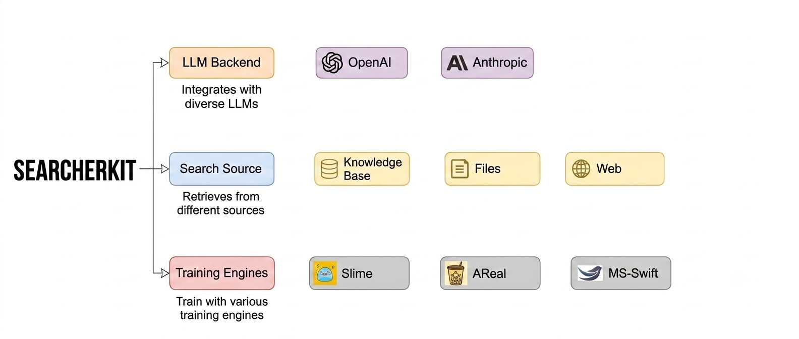

# 🔎 SearcherKit

SearcherKit 是面向搜索智能体的模块化运行时。它将智能体执行、异构搜索源、工具执行、模型适配、评估和训练集成统一到一套连贯的技术栈中。

### ✨ 亮点

- 🧠 **一套工具覆盖搜索智能体的完整生命周期** 在统一框架中搭建智能体、生成训练 rollout、运行评估并提供交互体验。从早期原型到面向生产的工作流都能复用相同组件，方便开发者专注提升智能体能力。

- 🌐 **连接多种搜索源** 通过统一的搜索源接口连接 Web 服务、Elasticsearch 索引和本地文件。可按需组合搜索源，无需修改智能体或工具设计，轻松构建适应各种场景的自定义检索流程。

- ⚡ **对开发者友好，面向大规模实验** 提供可灵活组合的模块化LLM接入点、格式解析器、搜索源和工具。原生异步执行和分层并发控制可加速大规模智能体运行，便于进行智能体评估和训练。中断恢复和样本日志追踪方便耗时实验的恢复、检查和复现。

- 🔥 **支持训练，达到SOTA水平。** SearcherKit 可被用作 SFT 和 RL 工作流的高吞吐 rollout（轨迹采样）运行时。同一套智能体和工具配置可统一支持交互式会话、离线评估、训练数据生成和 RL rollout。我们的强化学习实验在搜索Benchmark上取得了 8B 量级模型的SOTA级别结果。

### 🚀 快速开始

阅读[快速开始](docs/guide/index.qmd)，开始运行你的搜索智能体。

### 📖 文档

- [快速开始](docs/guide/index.qmd)
- [搜索本地文件](docs/guide/01-searching/01-search-files.qmd)
- [搜索网页](docs/guide/01-searching/02-search-web.qmd)

- [训练概览](docs/guide/02-training/01-training-overview.qmd)

- [项目架构](docs/guide/03-customizing/01-project-architecture.qmd)

- [CLI 参考](docs/guide/04-interface/01-use-the-cli-interface.qmd)
- [交互式 TUI](docs/guide/04-interface/02-use-the-interactive-tui.qmd)

### 🤝 参与贡献

SearcherKit 正在持续演进。欢迎提交 issue 和 PR，包括复现报告、新格式解析器、搜索源适配器、运行配方、训练集成、错误报告和文档改进等。

如果 SearcherKit 对你的研究有所帮助，或让智能体技术栈更易理解，欢迎为Star这个仓库，让更多开发者看到这个项目。

### 👤 团队

SearcherKit 由南方科技大学统计与数据科学系的贡献者在[Wei Hongxin](https://hongxin001.github.io/)助理教授指导下开发。

主要贡献者和维护者包括 [Li Hanyang](https://justinliii.github.io/)、[Zhang Haotian]()、[Yang Hanjie]()、[Wang Shuoyuan]()、[Lan Zijie]() 和 [Yu Zhengye]()。

### 📜 许可证

SearcherKit 使用 [MIT 许可证](LICENSE)。
