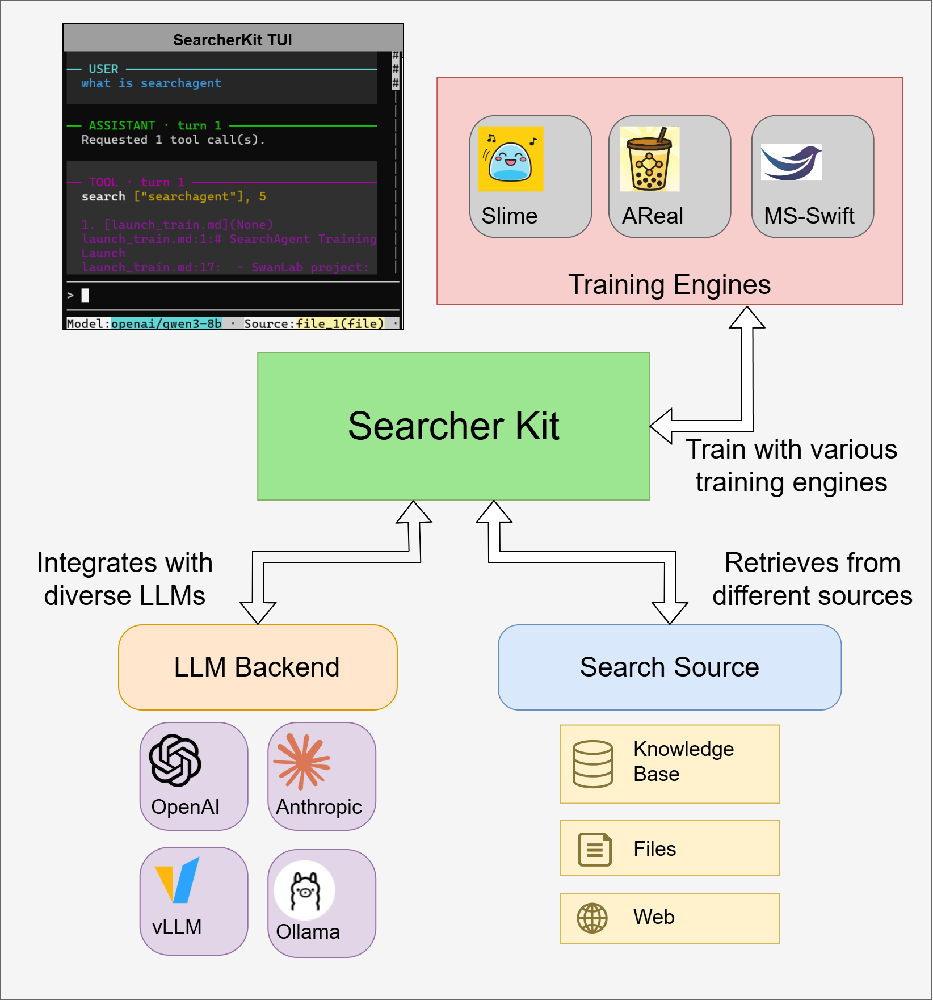

SearcherKit is a modular system for building AI agents that rely heavily on search. It handles everything from agent rollouts, LLM backends, tool calls, and benchmark evaluation, to training pipelines — all in one project.

## What it does

- **Build and run search agents** – Define agent behavior once, then use it for prototyping, evaluation, interactive demos, and large‑scale post training.
- **Connect to any data source** – Plug in web APIs, Elasticsearch, internal knowledge bases, or local files through a unified interface. Combine sources freely without touching agent code.
- **Scale without pain** – Async execution, flexible concurrency, checkpoint recovery, and detailed traces make batch jobs fast and debuggable. Swap models and backends easily.
- **Training‑ready** – The same agent and tool configuration can be used for evaluation, offline analysis, and integration with training pipelines, without needing to refactor code.

---

## Why SearcherKit?

- 🧩 **One codebase, many uses** – No more copying logic between research and production. What you build for an experiment works directly for evaluation and deployment.
- 🔌 **Plug‑and‑play sources** – Add or remove search backends in minutes. The agent doesn’t care where the data comes from.
- ⚡ **Fast and reliable** – Native async, smart concurrency, and automatic checkpointing let you run weeks‑long experiments without babysitting.
- 🏆 **Proven in RL** – We’ve used it to train competitive 8B models on real search tasks. The same pipeline is open and ready for your own training.

---

### 🚀 Quick Start

Jump right in with the [Quick Start guide](https://searcherkit.readthedocs.io/en/latest/docs/guide/index.html) — you’ll have a search agent running in minutes.

### 📖 Documentation

Browse the docs by topic:

- **Getting started** – [Quick Start](https://searcherkit.readthedocs.io/en/latest/docs/guide/index.html) · [Searching files](https://searcherkit.readthedocs.io/en/latest/docs/guide/searching/search-files.html) · [Searching webpages](https://searcherkit.readthedocs.io/en/latest/docs/guide/searching/search-web.html)
- **Training** – [Overview of SFT & RL workflows](https://searcherkit.readthedocs.io/en/latest/docs/guide/training/training-overview.html)
- **Customization** – [Project architecture and extending components](https://searcherkit.readthedocs.io/en/latest/docs/guide/customizing/project-architecture.html)
- **Interfaces** – [CLI reference](https://searcherkit.readthedocs.io/en/latest/docs/guide/interface/use-the-cli-interface.html) · [Interactive TUI](https://searcherkit.readthedocs.io/en/latest/docs/guide/interface/use-the-interactive-tui.html)

---

### 🤝 Contributing

SearcherKit is under active development. We welcome issues and pull requests for reproduction reports, new model parsers, source adapters, benchmark recipes, training integrations, bug fixes, documentation, and more.

If SearcherKit helps your research or simplifies your agent stack, please give us a ⭐ on GitHub – it helps others discover the project.

### 👤 The Team

SearcherKit is built and maintained by the group of Assistant Professor [Wei Hongxin](https://hongxin001.github.io/) and Professor [Jing Bingyi](https://sai.cuhk.edu.cn/en/teacher/162) in SUSTech and CUHK-SZ.  
Core maintainers: [Li Hanyang](https://justinliii.github.io/), [Zhang Haotian](https://github.com/Claritin0930), [Yang Hanjie](https://github.com/Foo1szz), [Wang Shuoyuan](https://github.com/Claritin0930), [Chen Yiyang](https://github.com/0xPabloxx), [Lan Zijie](https://github.com/zzekelan), and [Yu Zhengye](https://github.com/NZhengye).

### 📜 License

SearcherKit is licensed under the [MIT License](LICENSE).
