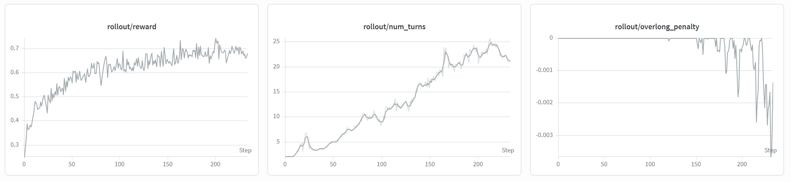

# SearchAgent

> Build, evaluate, and train search agents without locking your research to a
> single model, corpus, tool protocol, or training framework.

[](https://www.python.org/)
[](https://hydra.cc/)
[](#license)

SearchAgent is a modular runtime for search-intensive agents. It brings agent
rollouts, heterogeneous search sources, tool execution, model adapters,
benchmark recipes, evaluation, and RL training integration into one coherent
stack.

Use it to reproduce deep-search systems, compare models on the same retrieval
environment, connect private corpora, or generate trajectories for SFT and RL.

- **Training-ready agent runtime** — integrate search rollouts with AReaL and
  Slime while retaining control over LLM calls, exceptions, retries, and final
  answer generation.
- **One tool protocol, many backends** — run the same agent against memory,
  local files, web pages, Elasticsearch, MCP servers, or custom sources.
- **Tool parser independence** — Competable with different custom tool-use / searching formats like WebSailor, WebExplorer easy adaptation with new models.
- **Efficient, traceable batch execution** — native concurrency, session-to-
  endpoint affinity, global logs, and per-sample traces.
- **Reproducible experiments with one hydra config** — compose agents, models, sources, tools, and benchmark recipes with hydra config.
- **Designed to be extended** — add a source, tool, provider, parser, plugin,
  or recipe without rewriting the agent loop.

## Training integrations

SearchAgent is built to serve as the rollout and tool-use layer around modern
post-training systems.

We've conduced preliminary experiments with `AReaL` and `Slime` with the ASearcher dataset. And evaluate with F1 scores on the BrowseComp-Plus benchmark.



| Algorithm | AReaL result | Slime result |
| --- | :---: | :---: |
| GRPO | `0.3059` | `0.5392` |
| IGPO | `0.3532` | `-` |

Training systems can hook LLM generation as `Client` while SearchAgent owns message state, tool dispatch, recoverable
errors, retry policy, turn limits, and context-limit finalization.

Explore the training guides:

- [RL with AReaL](user-guide/training/rl-areal.qmd)
- [RL with Slime](user-guide/training/rl-slime.qmd)
- [Supervised fine-tuning](user-guide/training/sft.qmd)

LLM client hook and exception-control example:

```python
from collections.abc import Iterable
from typing import Any

from searchagent.common.errors import LLMError, RecoverableError
from searchagent.llm.base import ClientConfig, OpenAIConfig, get_client


class RLClient:
    """Client hooked to RL engine."""

    def __init__(self, rl_engine) -> None:
        self.engine = rl_engine

    async def complete_with_usage(
        self, messages: Iterable[dict[str, Any]], **kwargs: Any
    ) -> tuple[dict[str, Any], Any]:
        message, usage = await self.engine.generate(messages, **kwargs)
        return message, usage
```

## Model and benchmark results

SearchAgent can be used to evaluate & reproduce deep research tasks across web-search and wiki-QA environments.

<!-- | Category | Benchmarks / models |
| --- | --- |
| Web search | BCP, BrowseComp, BrowseComp zh |
| Wiki QA | GAIA, HotpotQA, DeepSearchQA |
| General models | Qwen, Gemma, GPT, DeepSeek, Claude |
| Search models | Tongyi-DeepResearch, OpenResearcher, Openseeker, DR-Venus, WebExplorer, SlimSearcher | -->

| Model | BrowseComp Plus | BrowseComp | BrowseComp zh | GAIA | HotpotQA | DeepSearchQA |
| --- | :---: | :---: | :---: | :---: | :---: | :---: |
| `Tongyi-DeepResearch` | `62.4%` | `<RESULT>` | `<RESULT>` | `<RESULT>` | `<RESULT>` | `<RESULT>` |
| `WebExplorer` | `48.5%` | `<RESULT>` | `<RESULT>` | `<RESULT>` | `<RESULT>` | `<RESULT>` |
| `SlimSearcher` | `<RESULT>` | `<RESULT>` | `<RESULT>` | `<RESULT>` | `<RESULT>` | `<RESULT>` |
| `DR-Venus` | `<RESULT>` | `<RESULT>` | `<RESULT>` | `<RESULT>` | `<RESULT>` | `<RESULT>` |
| `Openseeker` | `<RESULT>` | `<RESULT>` | `<RESULT>` | `<RESULT>` | `<RESULT>` | `<RESULT>` |
<!-- | `OpenResearcher` | `<RESULT>` | `<RESULT>` | `<RESULT>` | `<RESULT>` | `<RESULT>` | `<RESULT>` | -->

| Model | BrowseComp Plus | BrowseComp | BrowseComp zh | GAIA | HotpotQA | DeepSearchQA |
| --- | :---: | :---: | :---: | :---: | :---: | :---: |
| `Qwen3-8B` | `<RESULT>` | `<RESULT>` | `<RESULT>` | `<RESULT>` | `<RESULT>` | `<RESULT>` |
| `Gemma-4-12B` | `32.2%` | `<RESULT>` | `<RESULT>` | `<RESULT>` | `<RESULT>` | `<RESULT>` |
| `DeepSeek-V4-flash` | `<RESULT>` | `<RESULT>` | `<RESULT>` | `<RESULT>` | `<RESULT>` | `<RESULT>` |
| `GPT5.5` | `<RESULT>` | `<RESULT>` | `<RESULT>` | `<RESULT>` | `<RESULT>` | `<RESULT>` |
| `Claude Opus 4.8` | `<RESULT>` | `<RESULT>` | `<RESULT>` | `<RESULT>` | `<RESULT>` | `<RESULT>` |


To run new models, check the [Model and Parser](user-guide/inference/parser-llm.qmd) guide.

<!-- <details>
<summary>Model compatibility code example</summary>

Define Parser

```python
from typing import Any

from searchagent.common.messages import AssistantMessage
from searchagent.llm import ParsingError, UpstreamParser


class ToolPromptParser(UpstreamParser):
    """Add continue to use tool to the end of each tool response."""

    def to_model(self, messages: Iterable[ChatMessage]) -> Iterable[dict[str, Any]]:
        parsed = super().parse(messages)
        for message in parsed:
            if message["role"] == AssistantMessage.ROLE and "tool_response" in message:
                message["content"] += "\n\nContinue to use tool."
        return parsed
```

Connect the parser to the LLM client

```python
from searchagent.agent import SearchAgent
from searchagent.llm import ClientConfig, OpenAIConfig, get_client


client = get_client(
    ClientConfig(
        type="openai",
        model="Qwen3-8B",
        openai=OpenAIConfig(
            base_url="http://127.0.0.1:8001/v1",
            api_key="EMPTY",
        ),
    )
)

agent = SearchAgent(
    llm_client=client,
    parser=ToolPromptParser(),
    tools=[],
)
```

</details>

<details>
<summary>Model compatibility config example</summary>
Define Parser

```python
from typing import Any

from searchagent.common.messages import AssistantMessage
from searchagent.llm import ParsingError, UpstreamParser


class ToolPromptParser(UpstreamParser):
    """Add continue to use tool to the end of each tool response."""

    def to_model(self, messages: Iterable[ChatMessage]) -> Iterable[dict[str, Any]]:
        parsed = super().parse(messages)
        for message in parsed:
            if message["role"] == AssistantMessage.ROLE and "tool_response" in message:
                message["content"] += "\n\nContinue to use tool."
        return parsed
```

Connect the parser to the LLM client
```yaml
agent:
  llm_client:
    type: openai
    model: My-Tool-Calling-Model
    openai:
      base_url: http://127.0.0.1:8001/v1
      api_key: EMPTY

  parser:
    type: custom
    target: pkg://my_project.parsers:ToolPromptParser
```

</details> -->

## Quick start

SearchAgent requires Python 3.12 or newer.

```bash
git clone https://github.com/ml-stat-Sustech/searchagent.git
uv pip install -e searchagent
```

Inspect a bundled research recipe before running it:

```bash
uv run searchagent inspect \
  --config-path webexplorer \
  --config-name webexplorer
```

Run the agent against your model endpoint:

```bash
uv run searchagent run \
  --config-path webexplorer \
  --config-name webexplorer \
  agent.llm_client.model=Qwen3-8B \
  agent.llm_client.openai.base_url=http://127.0.0.1:8001/v1 \
  agent.llm_client.openai.api_key=EMPTY
```

The complete setup guide covers Elasticsearch, embedding services, multiple
LLM endpoints, evaluation, logging, and Windows/PowerShell commands:
[SearchAgent Guide](user-guide/index.qmd).

## Bring your own search environment

Sources and tools are wired by name, so an agent recipe can move between local
documents and production indexes without changing the agent implementation.

```yaml
agent:
  sources:
    - type: elasticsearch
      name: knowledge_base
      hosts: http://127.0.0.1:9200
      index: documents
      search_fields: [title, text]
      document_id_field: url

  tools:
    - type: search
      name: search
      source: [knowledge_base]
    - type: visit
      name: visit
      source: [knowledge_base]
```

Built-in plugin workflows can prepare and deploy benchmark corpora:

```bash
uv run searchagent plugins list
uv run searchagent plugins deploy local-wiki --help
uv run searchagent plugins deploy browsecomp-plus --help
```

See [Source and Tool](user-guide/inference/source-tool.qmd) for more.

## ArchitectureW

```text
src/searchagent/
├── agent/       agent loops, tool dispatch, and final-answer control
├── llm/         provider clients and model/training-format parsers
├── sources/     memory, file, web, Elasticsearch, and custom retrieval
├── tools/       search, visit, multi-source, summarizer, and MCP tools
├── plugins/     corpus conversion, preprocessing, and deployment
├── runtime/     batch execution, checkpoints, evaluation, and tracing
├── config/      reusable Hydra config groups
└── training/    SFT/RL integration points
```

Benchmark- and paper-specific configurations live in `recipe/`, keeping the
core runtime reusable across experiments.

### From question to search-grounded answer

```text
Question
   │
   ▼
Agent loop ─────► LLM client ─────► Parser
   ▲                                  │
   │                                  ▼
   └──── Tool result ◄──── Search / Visit / MCP
                              │
                              ▼
                  File · Web · Elasticsearch · Custom
```

Providers call model APIs. Parsers normalize model-specific output. Sources
own retrieval. Tools expose source capabilities to the agent. This separation
makes every layer independently replaceable and testable.

<!-- ## Examples and demos

| Topic | Code | Config | Demo |
| --- | --- | --- | --- |
| RL training | `<CODE_LINK>` | `<CONFIG_LINK>` | — |
| Model and tool compatibility | `<CODE_LINK>` | `<CONFIG_LINK>` | — |
| Source and plugin development | `<CODE_LINK>` | `<CONFIG_LINK>` | `<VIDEO_LINK>` |
| Secondary development | `<CODE_LINK>` | `<CONFIG_LINK>` | — |
| TUI | `<CODE_LINK>` | `<CONFIG_LINK>` | `<VIDEO_LINK>` | -->

## Documentation

- [Full guide](user-guide/index.qmd)
- [Parser and LLM adapters](user-guide/inference/parser-llm.qmd)
- [Source and tool system](user-guide/inference/source-tool.qmd)
- [Search execution flow](user-guide/inference/start-to-search.qmd)
- [CLI reference](docs/cli/index.qmd)

## Contributing

SearchAgent is actively evolving. Reproduction reports, new model parsers,
source adapters, benchmark recipes, training integrations, bug reports, and
documentation improvements are welcome. Open an issue with the model,
benchmark, and environment you want to support—or submit a focused pull
request.

If SearchAgent helps your research or makes your agent stack easier to reason
about, consider starring the repository. It helps more search-agent builders
find the project.

## License

**TODO**: Add license information.
