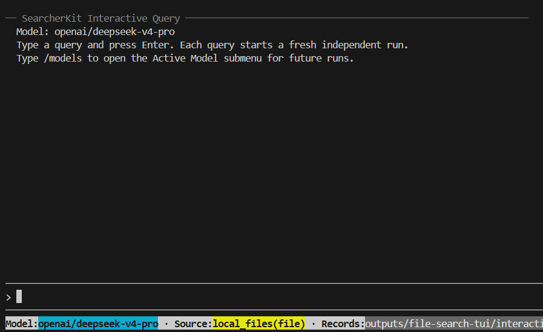

终端 UI 使用与批处理相同的智能体、解析器、搜索源、工具、追踪和历史记录序列化机制来运行临时查询。可用于 debug 或快速体验、展示。

### 启动 TUI

```bash
searcher inspect --config-path configs/demo/config.yaml
searcher tui --config-path configs/demo/config.yaml
```

Hydra 覆盖项可跟在命令选项之后：

```bash
searcher tui --config-path configs/demo/config.yaml \
  agent.llm_client.model=Qwen3-8B
```

命令执行后，TUI界面如下：



在下方输入问题后回车即可运行。每次输入之间的上下文互不共享。

### 斜杠命令

输入 `/` 打开命令菜单。

| 命令 | 行为 |
| --- | --- |
| `/models` | 为后续运行选择已发现的模型 |
| `/sources` | 为后续运行选择当前数据源 |
| `/thinking` | 显示或隐藏助手推理块 |
| `/tool-detail` | 切换精简或完整的工具交互详情 |
| `/clear` | 清空可见对话 |
| `/quit` | 退出 TUI |

模型和搜索源的更改只影响后续独立运行。查询执行期间，修改会话状态的命令会被拒绝；请先取消当前查询。

### 不启动完整 UI 运行单次交互查询

在普通终端中使用 `--query` 即可测试交互式流传输和记录流程：

```bash
searcher tui --config-path configs/demo/config.yaml \
  --query "Which component owns tool-call parsing?"
```

这适合快速测试，也适用于不便运行全屏终端应用的环境。

### 记录与追踪

默认记录目录为 `outputs/interactive`；如果运行配置定义了 `output_path`，则为 `<output_path>/interactive`。

```bash
searcher tui --config-path configs/demo/config.yaml \
  --interactive-output-path outputs/tui-sessions
```

每次查询都会写入带时间戳的 JSON 记录和追踪。无论运行完成、失败还是被取消，都会持久化其事件流、消息历史、计时、统计和错误信息。将交互式实验转为批处理配置时，可使用这些产物。
